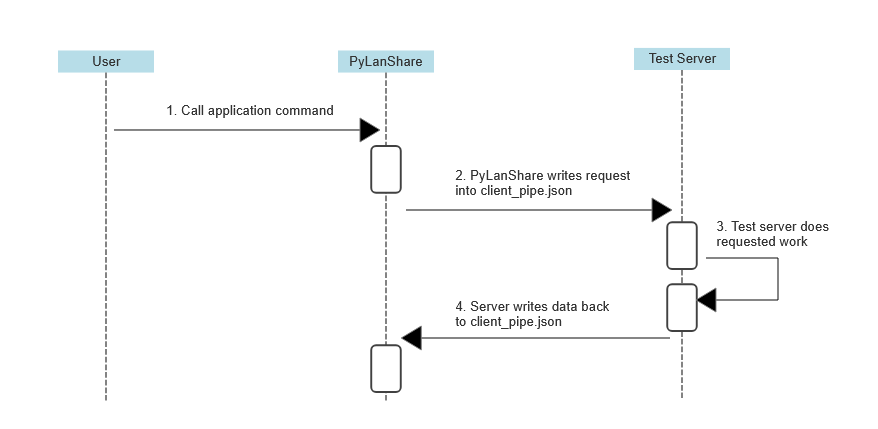

## How to use:
The CLI requests data by writing request data (the mode and if a blacklist is allowed) to the 'client_pipe.json' file, and recieves data of the machine back in the same file.

The recived data will follow the format:
```json
{
    "server_name": "LanShare Server", 
    "os": "Darwin", 
    "hostname": "mac-studio.local", 
    "username": "dfmb", 
    "local_ip": "192.168.1.1", 
    "port": "9527", 
    "download_dir": "path/to/directory", 
    "timestamp": "yyyy/mm/dd mm:ss"
}
```

This is called with "python3 py_lan_share.py -d"

## ULM Diagram
